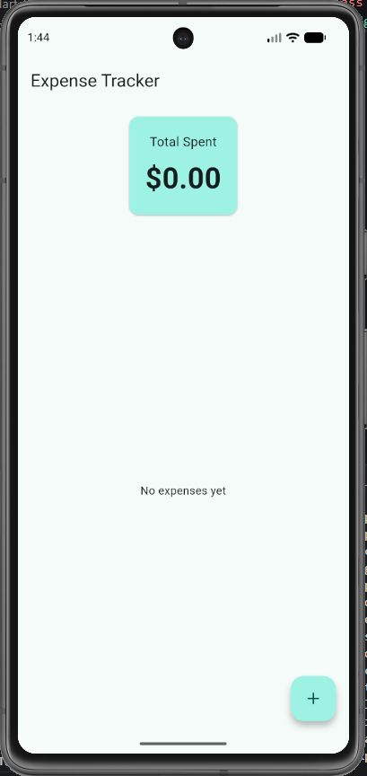
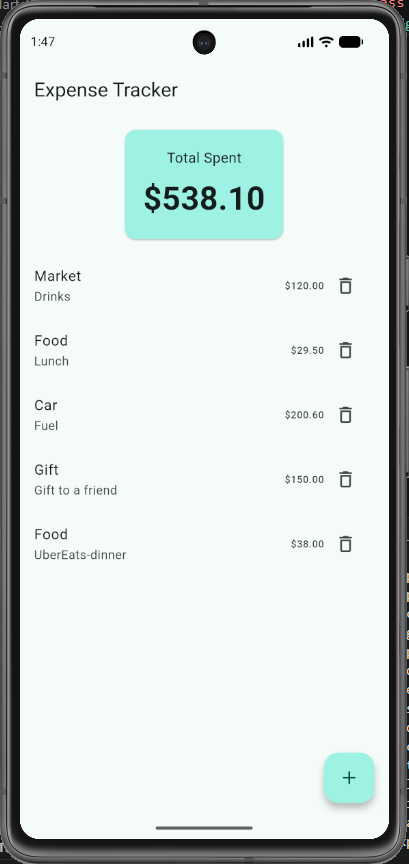
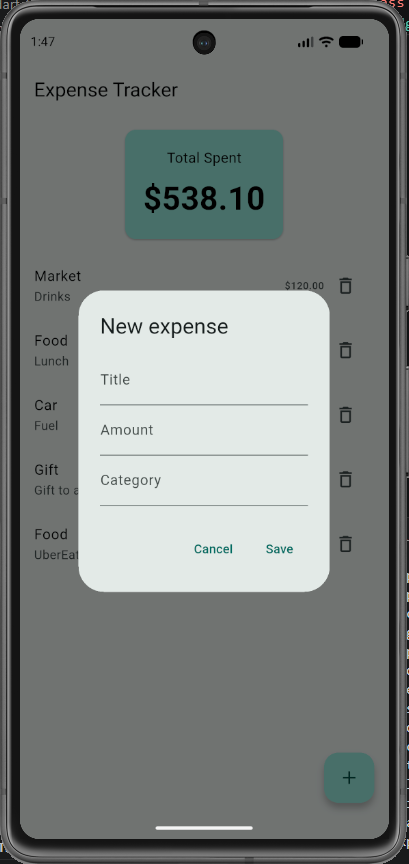

# Expense Tracker

A mobile expense tracking app built with Flutter and SQLite. Add expenses, see your total spending at a glance, and delete entries — all stored locally on the device, so your data persists between sessions.

## Screenshot





## Features

- Add expenses with a title, amount, and category
- View all expenses in a scrollable list
- See total spending calculated in real time
- Delete expenses
- Persistent local storage — data survives app restarts
- Input validation (no empty fields, valid amounts only)

## Tech Stack

- **Flutter** (Dart 3)
- **sqflite** for local SQLite database
- Full CRUD operations (Create, Read, Delete)
- Layered architecture (model / service / UI separation)
- Parameterized SQL queries to prevent SQL injection

## Project Structure

lib/
├── models/
│   └── expense.dart          # Expense model with toMap/fromMap
├── services/
│   └── database_services.dart # SQLite database and CRUD logic
├── screens/
│   └── expense_home_page.dart # UI and state management
└── main.dart                 # App entry point

## Getting Started

Make sure you have the [Flutter SDK](https://docs.flutter.dev/get-started/install) installed, along with an Android emulator or a connected device.

1. Clone the repository:
```bash
   git clone https://github.com/rdagli97/expense_tracker.git
   cd expense_tracker
```
2. Install dependencies:
```bash
   flutter pub get
```
3. Run the app:
```bash
   flutter run
```

> Note: This app uses `sqflite`, which runs on mobile (Android/iOS) and desktop platforms. It does not run in a web browser.

## What I Learned

This project was built to learn local data persistence in Flutter, including:

- Working with a SQLite database using the `sqflite` package
- Performing CRUD operations (Create, Read, Delete)
- Converting objects to and from database maps (`toMap` / `fromMap`)
- Writing safe, parameterized SQL queries
- Loading persisted data on app startup with `initState`
- Calculating derived values (total) with a getter